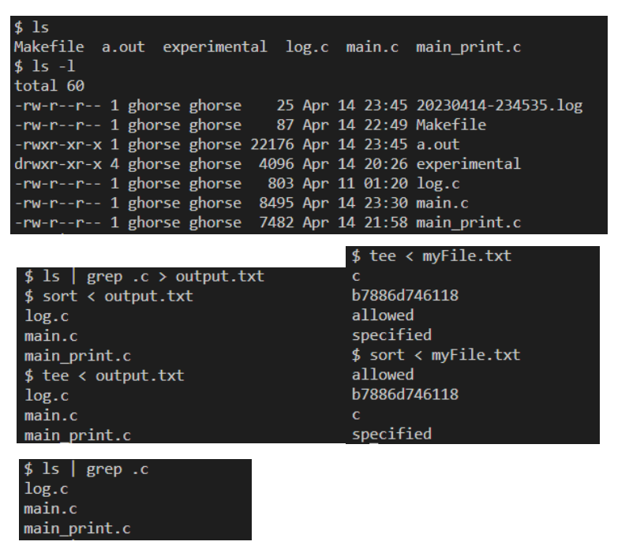

# c-terminal
 Terminal emulator in C

A terminal emulator capable of handling up to 20 shell commands in a single line, without using the "system()" function from the standard C
library. Instead, this code uses “fork()”, “execl()”, “wait()”, and “exit()” functions.
Example outputs:
